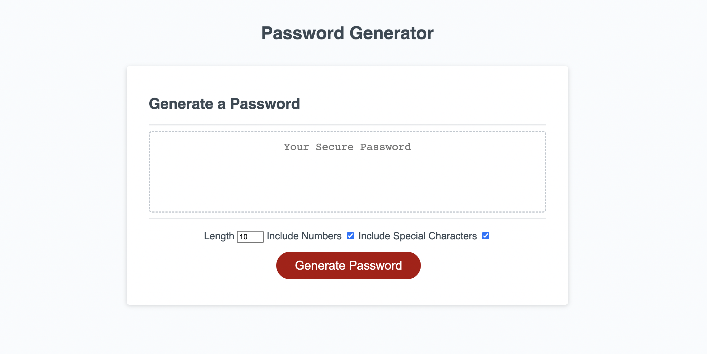
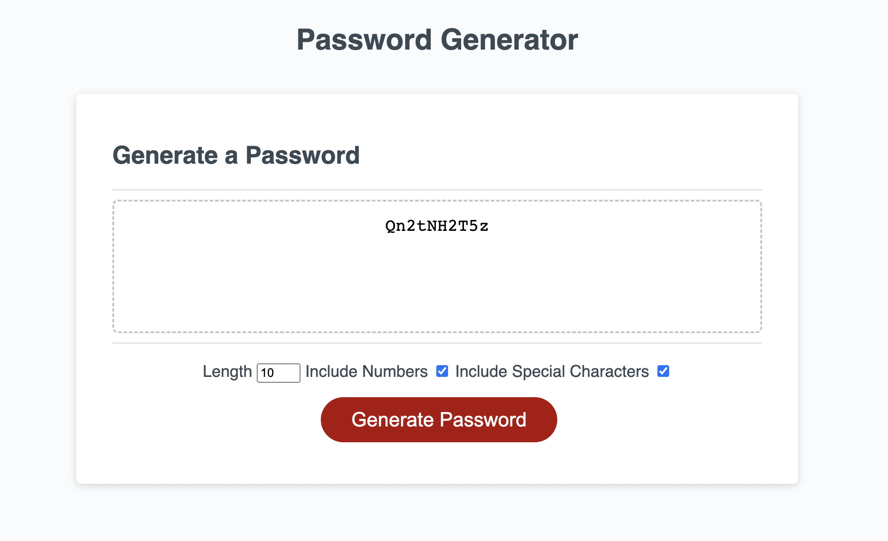
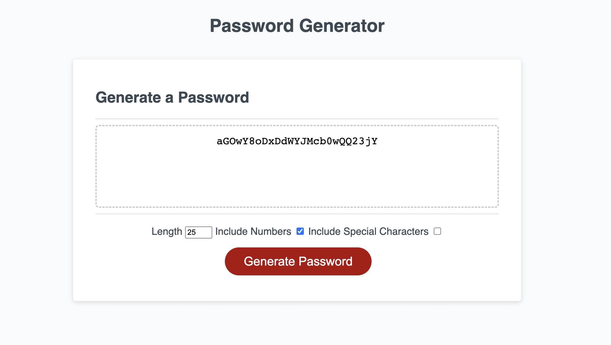
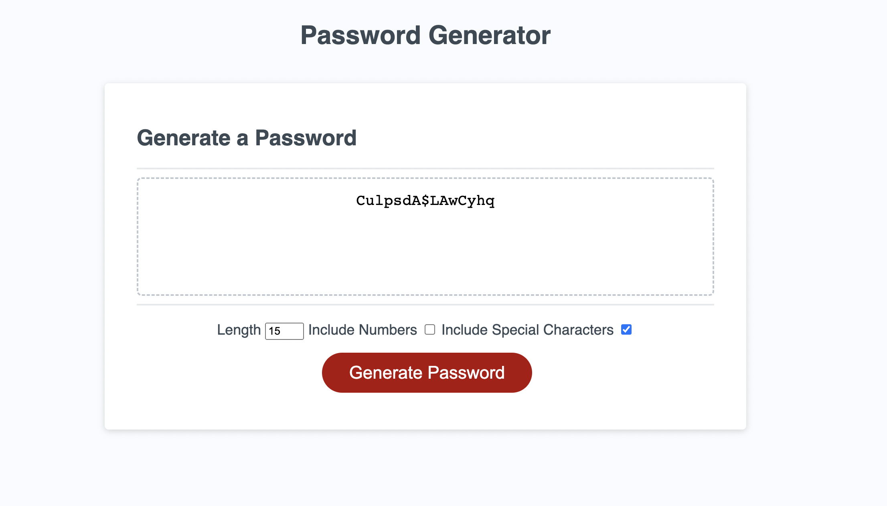
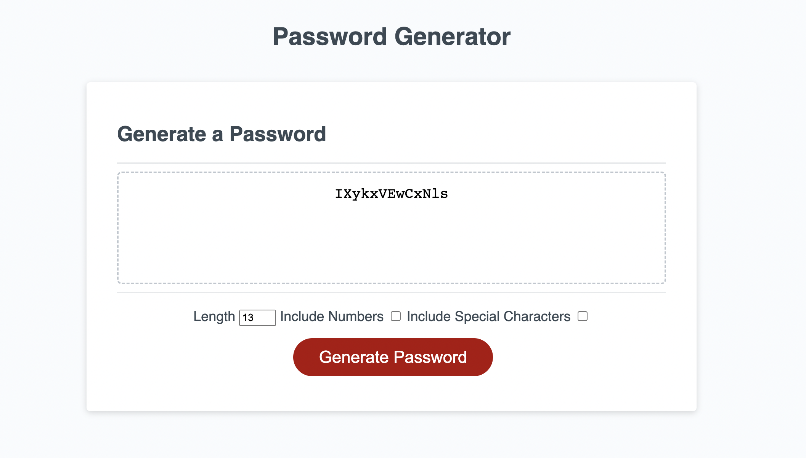
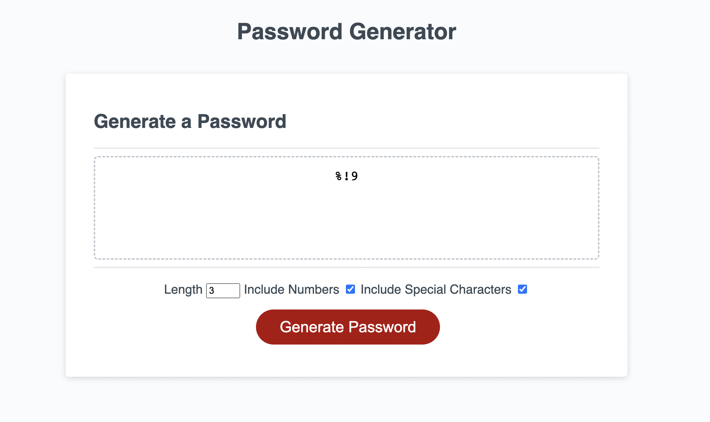

# 03 JavaScript: Password Generator

## Description

As an odd numbered week challenge, my task is to modify code provided to meet the acceptance criteria. I used primarily JavaScript to create a random password generator that links to the HTML and CSS stylesheet provided. 

The password generator should have the ability to include uppercase and lowercase letters, numbers, and special characters. The passwords generated are to be no less than 8 characters and no more than 128 characters in length. Using variables and functions, the application works as expected. I used the Chrome Dev tools to identify errors, a variety of W3Schools and MDN documentation to make sure the logic pieces followed appropriate syntax and naming conventions, as well as examples of other finished projects available online. Each developer came up with a different solution, so determining which code would work best for my project was a fun yet challenging task. Ultimatley, I decided to build an input box for numbers and checkboxes into the html that will allow the user to select the criteria they wish to include in their password rather than utilize window alerts and prompts. From my experience, this determination allows the finished application to be streamlined and simple for the user. 

Utlizing functions correctly was by far my largest challenge. I read through documentation and worked through tutorials on codecademy to better understand the functionality. Once I had a better grasp on the pieces, pseudocoding each portion helped simplify the task into more maneagable portions. Because functions are utilized so often, I know I need to continue working through tutorials and reading through documentation to be more confident in my understanding. 

The only challenge that remains unsolved is the number input box for password length. The minimum value is set to 8, but as is, the user could select an input of less than 8 and still have a password generated. Using the Chrome Dev Tools, no errors have been deteched in the code, so identifying where the length of the password needs to be declared is the next step in development. 

## Link to Deployed Application

